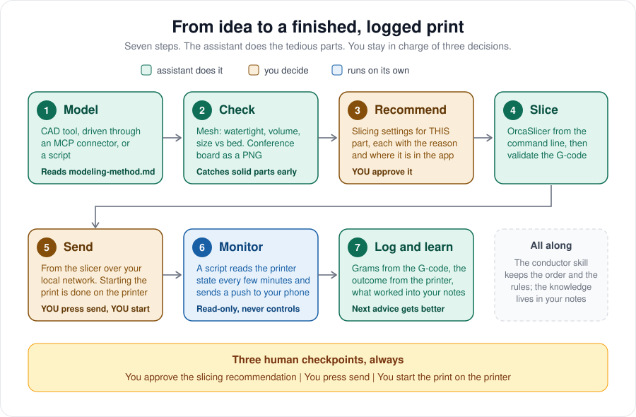
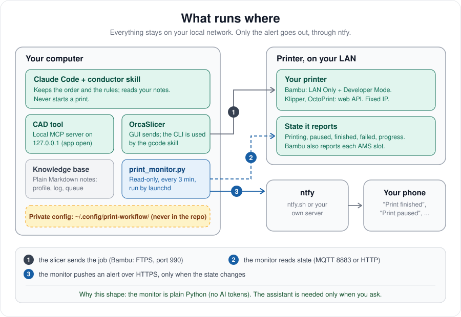

<div align="center">

# 3d-print-workflow

**An AI-assisted 3D printing workflow for any printer, with a battle-tested track for Bambu Lab's closed ecosystem.**<br>
Model, check, slice, send, monitor and log, with phone alerts. A safe, documented, honestly-labelled template: clone it, fill in your own details, print.

[](https://github.com/lavinialencar/3d-print-workflow/actions/workflows/ci.yml)




</div>

> **Unofficial.** This project is not affiliated with, endorsed by or supported by Bambu Lab, Autodesk, Anthropic, Prusa, the Klipper, Moonraker or OctoPrint
> projects, or the OrcaSlicer project. LAN access modes change how your printer is reachable; you are responsible for your own network and hardware.

> **This is a working template under active development, not a finished, versioned release.** Start small: run it on a test cube or another small, low-stakes
> part first, on a printer you can watch, before trusting it with a long print or your good filament. Scale up size and complexity gradually as you build
> confidence with it on your own hardware. The [table below](#what-is-proven-and-what-is-not) says exactly what has and has not been verified; a real print
> can still fail for reasons the settings alone don't catch (see the CLI slicing row for one found this way).

---

## Contents

[Why this exists](#why-this-exists) · [Choose your printer](#choose-your-printer) · [What you get](#what-you-get) · [What is proven, and what is not](#what-is-proven-and-what-is-not) ·
[Quick start](#quick-start) · [How it fits together](#how-it-fits-together) · [Repository map](#repository-map) ·
[Principles](#principles) · [FAQ](#faq) · [Roadmap](#roadmap) · [Contributing](#contributing) · [License and credits](#license-and-credits)

## Why this exists

The workflow (model, check, slice, send, monitor, log) is the same for every printer. What differs is how much the printer's maker lets you reach it. Three
problems show up as soon as you want your own tools in the loop, and the first two are worst on **Bambu Lab**:

1. **A locked-down printer silences your tools.** Bambu's LAN Only mode cuts the cloud, and with it the Handy app's push notifications. Nobody tells you when a
   print finishes, fails or pauses. On Klipper and OctoPrint the same alerts are easy, and still not built in.
2. **Moving from Bambu Studio to OrcaSlicer looks trivial and is not.** A filament profile copied across is *silently ignored*, loses its identity in the AMS,
   or crashes command-line slicing. Three separate traps, none with an error message.
3. **AI assistants over-promise.** Ask one to "set up my printing workflow" and you get a confident description of things that were never run.

This repository is the result of building the working version, and keeping notes on what actually happened.

## Choose your printer

| Printer | Track | Status |
|---|---|---|
| **Bambu Lab** (P2S; X1, A1, P1 share the protocol) | [The Bambu Lab track](docs/03-bambu-lab-track.md): LAN Only, Developer Mode, the traps and the ways around them | ✅ verified on a P2S |
| **Klipper** (Moonraker) | [Other printers](docs/05-other-printers.md#klipper-with-moonraker) | 🟡 experimental |
| **OctoPrint** | [Other printers](docs/05-other-printers.md#octoprint) | 🟡 experimental |
| **Anything else** | [Add an adapter](docs/05-other-printers.md#adding-your-own-printer): one small pure function | ⚪ contribute |

Modeling, checking, recommending, slicing (OrcaSlicer, PrusaSlicer or CuraEngine) and logging do not depend on the printer at all.

## What you get

| | | |
|---|---|---|
| **A monitor with phone alerts** | `scripts/print_monitor.py` | Read-only. Tells you when a print starts, finishes, fails, pauses, is cancelled, or the printer goes silent. Adapters for Bambu Lab, Klipper and OctoPrint. Plain Python, no AI tokens |
| **A profile converter** | `scripts/studio_to_orca_filament.py` | Turns a Bambu Studio filament profile into one OrcaSlicer accepts, and explains the three traps |
| **A scheduler installer** | `scripts/print_monitor_launchd.py` | Runs the monitor every few minutes on macOS, with `print`, `install`, `status`, `uninstall` |
| **A consumption reader** | `scripts/gcode_consumption.py` | Reads grams and length from a sliced file and writes the log row for you |
| **A settings comparer** | `scripts/gcode_settings_diff.py` | Shows which slicer settings differ between two G-codes, e.g. the GUI's and the command line's |
| **A conductor skill** | `skill/print-conductor/` | A thin instruction file that keeps the cycle in order and the rules unbroken |
| **A knowledge-base template** | `knowledge-base-template/` | Five plain Markdown notes: hub, printer profile, modeling checklist, filament log, print queue |
| **Guards** | `tools/` | A personal-data scanner and a documentation link checker, both run in CI |
| **Twelve guides** | `docs/` | Step by step, with checkpoints, diagrams, an example session and a troubleshooting table |

## What is proven, and what is not

Every project like this hides its gaps. This one lists them. **Verified** means it was run on a real printer by the author.

| Piece | Status | Detail |
|---|---|---|
| Read printer state (Bambu Lab P2S, LAN Only + Developer Mode) | ✅ Verified | real printer |
| Alert when a print **starts** | ✅ Verified | push received on a phone |
| Alert when a print **pauses**, with the error code | ✅ Verified | push received |
| Alert when a print **finishes** | 🟡 Not yet observed | the logic is unit-tested; a real finish was not seen |
| Alert "printer not responding" | 🟡 Logic tested | unit-tested; not yet seen live |
| Klipper (Moonraker) and OctoPrint adapters | 🟡 Experimental | unit-tested on sample payloads from the public API docs; **never run on a real printer** |
| Studio to Orca profile converter | ✅ Verified | reproduces a profile that works in a real Orca install, key for key; unit-tested |
| Scheduled run with launchd | ✅ Verified | ran repeatedly with exit code 0 |
| Command-line slicing with Orca + G-code validation | ✅ Verified, with a fix, on flat and on tilted+supported geometry, physically printed | root cause confirmed on a real cube: the CLI does not walk a machine profile's `inherits` chain (30 missing keys, including the bed size). `scripts/fix_bambu_machine_profile.py` patches just those keys; after the fix, 0 of the settings that shape the print (walls, layers, infill, shells, supports, seam, speeds) differed from the GUI, confirmed again on a 45°-tilted cube with tree supports. Two CLI-only crashes found and worked around along the way: `--rotate*`/`--scale` flags segfault (bake the transform into the STL instead), and a brim near the bed edge on tilted+supported geometry can crash slicing (keep the part clear of the edge, or use `brim_type: no_brim` to diagnose). Then physically printed, not just settings-compared: a first attempt with default tree-support settings failed mid-print (the object detached from its support, caught by the printer's own spaghetti-detection camera) because the default support interface is tuned for easy removal, not for a small, steeply overhung contact area; tightening just the top interface (`support_top_z_distance` to 0, `support_interface_spacing` to 0.1mm) fixed it, reprinted to completion with no defects beyond normal support-contact marks. See [docs/06](docs/06-slicing-with-an-assistant.md#pitfall-the-command-line-does-not-resolve-profile-inheritance-like-the-gui-and-the-fix-that-closes-it) |
| Sending a job from Orca to a Bambu printer | ✅ Verified, twice, including a real overhang | job ran to completion on the P2S (`FINISH`, 0 error) for a plain cube and, after fixing a support failure, for a 45°-tilted tree-supported cube; see the physical-print note under the CLI row above |
| Sending a plain `.gcode` straight to a Bambu printer over the network (no OrcaSlicer) | 🟡 Verified, with a hard limit | `scripts/bambu_lan_print.py`-style FTPS upload + MQTT `gcode_file` works for upload and start, but the printer always pulls from the external spool holder for a bare `.gcode` — AMS mapping needs `Metadata/slice_info.config`, which only exists inside a `.3mf`. See `scripts/package_gcode_as_3mf.py` |
| Packaging a plain `.gcode` into a real `.gcode.3mf` so AMS mapping works | 🟡 Mechanically verified, not yet print-proven through this exact script | `scripts/package_gcode_as_3mf.py` swaps a template project's `Metadata/plate_N.gcode` for your G-code and leaves `slice_info.config` untouched; confirmed byte-for-byte on a real template and real command-line G-code, 11 tests. The equivalent hand-built swap was proven live the same day, but not yet this script end to end |
| AMS recognises the converted profile | 🟡 Author reports it works | the converter keeps the id the slots already report; not independently checked |
| Opening a file into OrcaSlicer from outside the app (script, `open -a`, Finder double-click) | 🟡 Half works, half is a real OrcaSlicer bug | a plain `.stl`, opened while OrcaSlicer is not yet running, loads reliably with no dialog. A `.gcode.3mf` opened the same way opens a broken, empty "Import SLA archive" dialog instead (traced to OrcaSlicer's own file-type dispatch); sending a second file to an already-running OrcaSlicer can crash it or spawn a duplicate process. See [docs/06](docs/06-slicing-with-an-assistant.md#a-third-crash-opening-a-3mf-from-outside-the-app-finder-open--a-a-script-can-hang-or-crash-orcaslicer) |
| Assistant modeling through a CAD MCP server | 🟡 Connected, not yet exercised | Autodesk Fusion's local MCP server connects; modeling a real part is still to do |
| Search for an existing model first (Printables, Thingiverse) | ✅ Verified live | `scripts/find_models.py` lists likes, makes and licence from both; the Printables endpoint is unofficial and can change, Thingiverse uses its official API with your own token; MakerWorld and Thangs are read through a real browser, Cults3D shows a bot check and is left alone, see [docs/08](docs/08-modeling-and-delivery.md#0-look-for-it-before-you-model-it) |
| Part analysis: geometry to questions and settings | 🟡 Tested on synthetic shapes and 4 real files | `scripts/analyze_part.py` measures slopes, overhangs, flat tops, walls and six orientations; the thresholds are heuristics that cite their source or say so, see [docs/12](docs/12-slicing-by-part.md). Not yet validated against prints |
| Per-part slicing overrides from the command line | 🟡 Mechanics proven | 4 walls, 25% infill and a brim reached the G-code with no GUI; the rest of the profile may differ from the GUI, use `gcode_settings_diff.py` to check |
| Other Bambu models (X1, A1, P1) | ⚪ Untested | same protocol family, different profiles |
| Linux and Windows | ⚪ Untested | scripts are standard library; only the scheduler is macOS-specific |

If you verify something on your hardware, please tell us: there is an issue template for exactly that.

## Quick start

The full version, with a checkpoint after every step, is [docs/00-quick-start](docs/00-quick-start.md). The shape of it:

```bash
git clone https://github.com/lavinialencar/3d-print-workflow.git && cd 3d-print-workflow

# 1. printer: make it reachable (Bambu: LAN Only + Developer Mode; Klipper/OctoPrint: the web API)   (docs/03 or 05)
# 2. router:  reserve the printer's IP so it never changes                                           (docs/02)

# 3. private config, OUTSIDE the repository
mkdir -p ~/.config/print-workflow && chmod 700 ~/.config/print-workflow
cp config/ntfy.example.json ~/.config/print-workflow/ntfy.json
cp config/bambu-printers.example.json ~/.config/print-workflow/bambu-printers.json    # Bambu; see config/ for Klipper and OctoPrint
chmod 600 ~/.config/print-workflow/*.json
open -e ~/.config/print-workflow/bambu-printers.json     # fill in, save with Cmd+S

# 4. prove the connection, changing nothing
python3 scripts/print_monitor.py --print-status

# 5. schedule the alerts
python3 scripts/print_monitor_launchd.py print           # look first
python3 scripts/print_monitor_launchd.py install
```

Then set up your slicer and your notes: [docs/04](docs/04-orca-and-bambu-studio-migration.md), [docs/09](docs/09-the-conductor-skill.md),
[`knowledge-base-template/`](knowledge-base-template/README.md).

## How it fits together

<p align="center"></p>

Everything runs on your computer and talks to the printer over your local network. Only the alert leaves the house, through
[ntfy](https://ntfy.sh). Details: [docs/01-architecture](docs/01-architecture.md).

## Repository map

```
.
├── README.md                    you are here
├── docs/                        twelve guides, from quick start to privacy
│   ├── 00-quick-start.md            pick your track
│   ├── 01-architecture.md
│   ├── 02-network-and-fixed-ip.md   any printer
│   ├── 03-bambu-lab-track.md        LAN Only, Developer Mode, the ways around the lock-in
│   ├── 04-orca-and-bambu-studio-migration.md   the three profile traps
│   ├── 05-other-printers.md         Klipper, OctoPrint, adding your own
│   ├── 06-slicing-with-an-assistant.md
│   ├── 07-monitor-and-alerts.md
│   ├── 08-modeling-and-delivery.md
│   ├── 09-the-conductor-skill.md
│   ├── 10-troubleshooting.md
│   ├── 11-privacy-and-publishing.md
│   ├── 12-slicing-by-part.md        measure the shape, ask, decide, compare scenarios
│   └── examples/example-session.md    what a session looks like (illustrative)
├── scripts/                     the seven tools (standard library, except the part analyzer, which needs numpy)
├── skill/print-conductor/       the thin conductor skill, as a template
├── knowledge-base-template/     five Markdown notes to copy into your own
├── config/                      example config files (never the real ones)
├── tools/                       personal-data scanner and documentation link checker
├── tests/                       unit tests, all on synthetic data
└── assets/                      the diagrams (SVG)
```

## Principles

1. **Never start a print automatically.** Sending is a click; starting is a tap on the printer's screen.
2. **Read-only where possible.** The monitor cannot control the printer.
3. **Secrets live outside the repository and outside synced folders.** An access code or API key is a password; on public ntfy.sh, so is the topic.
4. **Say what was tested.** Every claim in this project has a date or a status.
5. **The assistant explains.** A recommendation without a reason teaches nothing and hides mistakes.
6. **Plain files over clever systems.** Markdown notes, JSON config, Python standard library.

## FAQ

**I have a Prusa, Creality, Elegoo or Anycubic printer.** The workflow still applies: model, check, recommend, slice with the right profile, log. For alerts you
need an adapter for your printer's API. Writing one is a small pure function, see [Adding your own printer](docs/05-other-printers.md#adding-your-own-printer).

**Does it work on an X1C, A1 or P1S?** Probably with small changes, but untested here. The status report and ports come from the same family; the profile names and
AMS layout differ. Reports welcome.

**Do I need the AI assistant?** No. The monitor, the converter and the scheduler installer are ordinary scripts and work without it. The assistant adds modeling,
slicing recommendations and bookkeeping.

**Does it cost money?** The scripts and ntfy.sh are free. The assistant needs a Claude Code account. Check the terms of your CAD tool for your use.

**Is LAN Only mode safe?** It removes the cloud path, which reduces exposure, but anyone on your Wi-Fi can reach the printer. Read the security notes in
[docs/02](docs/02-network-and-fixed-ip.md#security-notes).

**Windows or Linux?** The scripts are standard-library Python. Only `print_monitor_launchd.py` is macOS-specific; use cron or Task Scheduler elsewhere. A contribution
here would be very welcome.

**Why not just use the manufacturer's app?** Apps cover the happy path. This project is for people who want their own tools in the loop, or who chose a mode (such as
Bambu's LAN Only) that switches the app's features off.

## Roadmap

- [ ] Observe a real **print finished** alert and mark it verified
- [ ] Run the Moonraker and OctoPrint adapters on real printers and promote them out of experimental
- [ ] Ship a tested `mesh_check` and `conference_board` script (today they are described in [docs/08](docs/08-modeling-and-delivery.md))
- [ ] A tested container recipe for running the monitor on a NAS or Raspberry Pi
- [ ] A cron and systemd option for Linux
- [ ] More adapters: Prusa Link, Creality, others
- [ ] Per-part slicing overrides through a generated slicer profile
- [ ] A compatibility table filled by users

## Contributing

Bug reports, compatibility reports and pull requests are welcome. Read [CONTRIBUTING.md](CONTRIBUTING.md) first: it explains how to run the tests, how to state what
you verified, and the one rule that matters most, **never commit personal data**. Report security issues privately, see [SECURITY.md](SECURITY.md).

```bash
python3 -m unittest discover -s tests -v     # no hardware needed
python3 tools/scan_personal_data.py          # must print "clean"
python3 tools/check_links.py                 # every doc link resolves
```

## License and credits

[MIT](LICENSE). Built on the shoulders of:

- [text-to-cad](https://github.com/earthtojake/text-to-cad) (MIT): the `gcode`, `bambu-labs` and `dfam-check` skills this project drives
- [OrcaSlicer](https://github.com/OrcaSlicer/OrcaSlicer) (AGPL-3.0): the slicer. This repository does not redistribute any of its files
- [ntfy](https://ntfy.sh): free, simple push notifications
- [Bambu Lab's wiki](https://wiki.bambulab.com), for the documented third-party options and error codes

"Bambu Lab", "P2S", "AMS", "Bambu Studio", "Klipper", "OctoPrint" and other names are trademarks of their owners. They are used here only to describe compatibility.
