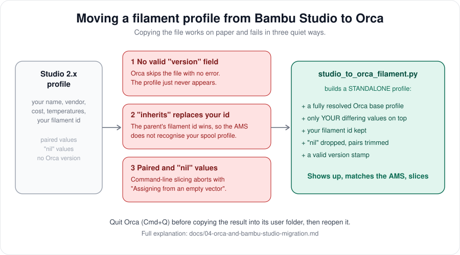

# OrcaSlicer setup, and moving your profiles from Bambu Studio



OrcaSlicer is a fork of Bambu Studio with a command line, which is what lets an assistant slice for you.
This page covers installing it and, more importantly, the **three quiet traps** that make a filament profile
copied from Bambu Studio fail in Orca. They cost hours the first time.

## Install and first run

```bash
brew install --cask orcaslicer
```

On first launch a wizard asks whether to install the **Bambu Network plug-in**. That plug-in is Bambu's own
proprietary component (not developed by the Orca team) and is what lets a slicer talk to a Bambu printer.
Install it if you want to send jobs from Orca. Then pick your printer and nozzle. The P2S has ready-made
machine and process profiles, for example `0.20mm Standard @BBL P2S`.

> Sending from Orca: some users report that the send dialog hangs on the P2S after asking for the access code
> ([OrcaSlicer issue 12621](https://github.com/OrcaSlicer/OrcaSlicer/issues/12621)). In LAN Only mode with
> Developer Mode it is expected to work; in cloud mode, third-party slicers go through Bambu Connect. If yours
> hangs, export the sliced 3MF and send it another way, and see [troubleshooting](10-troubleshooting.md).

## The three traps

You exported a filament profile from Bambu Studio 2.x, copied it into Orca's user folder, restarted Orca, and
nothing. Here is why.

| # | What goes wrong | Symptom | Cause |
|---|---|---|---|
| 1 | The file has no valid `version` | **The profile never appears.** No error anywhere | Orca silently skips a user profile it cannot version-check |
| 2 | The profile `inherits` another one | The AMS does not recognise your spool | A child profile takes the **parent's** `filament_id`, whatever your file says |
| 3 | Studio 2.x writes values in **pairs** or as `"nil"` | Command-line slicing aborts: `Assigning from an empty vector` | Studio stores one value per nozzle type; Orca 2.4 expects a single value |

## The fix: one script

`scripts/studio_to_orca_filament.py` builds a **standalone** Orca profile: a fully resolved Orca system
profile as the base, with only the values your Studio profile changes laid on top.

1. Find your Studio profile. On macOS user filament profiles live under
   `~/Library/Application Support/BambuStudio/user/<numeric-id>/filament/` (custom ones often in a `base/` subfolder).
2. Pick the Orca base profile closest to your material. The name is the file name without `.json` in
   `~/Library/Application Support/OrcaSlicer/system/BBL/filament/` (for example `Bambu PLA Basic @BBL P2S`).
3. Preview, then build:

```bash
python3 scripts/studio_to_orca_filament.py \
  --studio-profile "My PLA @Bambu Lab P2S 0.4 nozzle.json" \
  --base "Bambu PLA Basic @BBL P2S" --dry-run

python3 scripts/studio_to_orca_filament.py \
  --studio-profile "My PLA @Bambu Lab P2S 0.4 nozzle.json" \
  --base "Bambu PLA Basic @BBL P2S" --out-dir ./out
```

4. **Quit Orca with Cmd+Q** (closing the window is not enough; the app keeps running), then copy the
   result and reopen:

```bash
cp ./out/*.json "$HOME/Library/Application Support/OrcaSlicer/user/default/filament/"
```

The dry run lists the values it keeps from your profile, so you can see at a glance that your cost, vendor
and temperatures survived.

Made one profile per nozzle size (0.2, 0.4, 0.6, 0.8)? Run it once per file, with the matching base.

## Prove it loaded: read Orca's log

The most useful debugging habit: Orca logs how many user filament profiles it loaded.

```bash
grep -E "load_presets: loaded [0-9]+ presets from .*filament" \
  "$HOME/Library/Application Support/OrcaSlicer/log/"debug_*.log.0 | tail -3
```

`loaded 4 presets` means it worked. `loaded 0 presets` with files sitting in the folder means Orca skipped
them: check the `version` field (trap 1) first. The same log also prints each profile's `filament_id`, so you can
confirm trap 2 is solved.

## Make the AMS recognise your spool

The printer reports, for every AMS slot, a **filament id** (`tray_info_idx`) along with the color and type.
Orca matches your profile to the slot by that id. If your spools were set up in Bambu Studio, the slots
already carry the id of your Studio profile: the script keeps it, so they match again. To see what
the slots report, run the `bambu-labs` skill's `status` command and look at the `ams` block.

## Licensing note

Orca's system profiles are part of OrcaSlicer, which is AGPL-3.0. A converted profile is a merged copy of
one of them. **Share the method and the script, not the converted JSON files.**

Next: [04 Slicing with an assistant](06-slicing-with-an-assistant.md).
